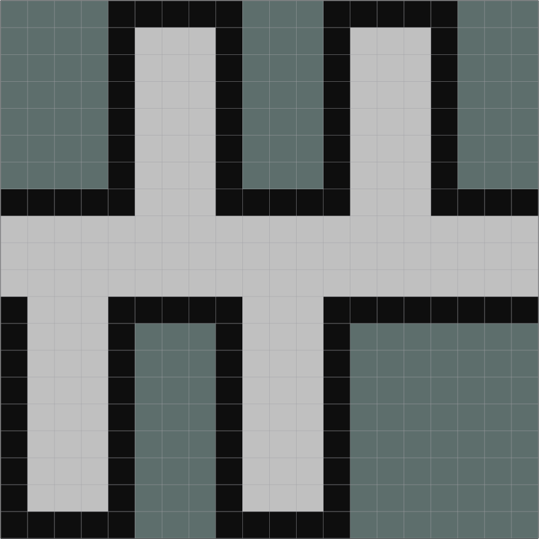
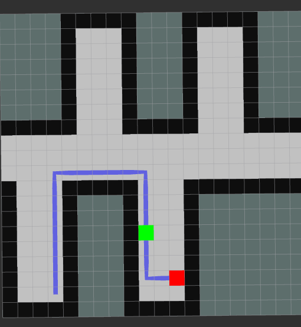

# Practical Course: Intelligent Mobile Robots with ROS (PCIMR)

## Tutorial 05: Path Planning & Control

### Introduction

The purpose of this tutorial demonstrates an understanding of search algorithms
It considers the implementation of the A* algorithm in 2D space.

---
### Node Overview

The simulator can be started with:

    roslaunch pcimr_navigation navigation.launch

, which listens to a path on the /global_path topic and publishes on /move.

The node itself is then launched with

  rosrun pcimr_tutorial planning_node

, which publishes the planned path: '/global_path', Path,  
      the visualization of the path:'/visualization/plan', Marker,  
      the visualization of the robot: '/visualization/robot_pos', Marker,  

  and listens to the robot position: '/robot_pos', Point,  
                          and map: '/map', OccupancyGrid,  

# Problem Outline

<table style="margin-left: auto; margin-right: auto; table-layout: fixed; width: 100%">
  <tr>
    <td style="width: 48%; height: 50%"> </td>
    <td style="width: 48%; height: 50%"> </td>
  </tr>
  <tr>
    <td style="width: 48%;" valign="top"> <b>Fig.1:</b> Grid-world for this exercise, grey pixels are free space, black ones are occupied and grey/green ones are unknown.
    </td>
    <td style="width: 48%;" valign="top"> <b>Fig.2:</b> An example of the robot, path and goal mid journey.
    </td>
  </tr>
</table>

### Implementation Details

As a heuristic is chosen the Euclidean distance.  
A random goal is set by the algorithm and a path calculated.  
Once the robot reaches this path, a new random goal is generated.  

A class Graph_Node is created, with attributes  
  x int  
  y int  
  location tuple(int, int)  
  id int  
  cost  int -- denoting min cost to target.  

The frontier is initialized from the robot starting position.
Assuming the robot can only move NSWE, each of those, as long as the movement is
within bounds, is added to the frontier. The node in the frontier with the lowest cost is expanded.
This is called recursively until the end goal is within the frontier.
Expanded nodes are also kept in a list, to avoid re-calculation on the same node.
Once the goal is also included as a node, we have a transversable list from the start to the finish.  
The path is then created by starting at the end goal and continuously selecting geometrically adjacent nodes
until the start is found.
